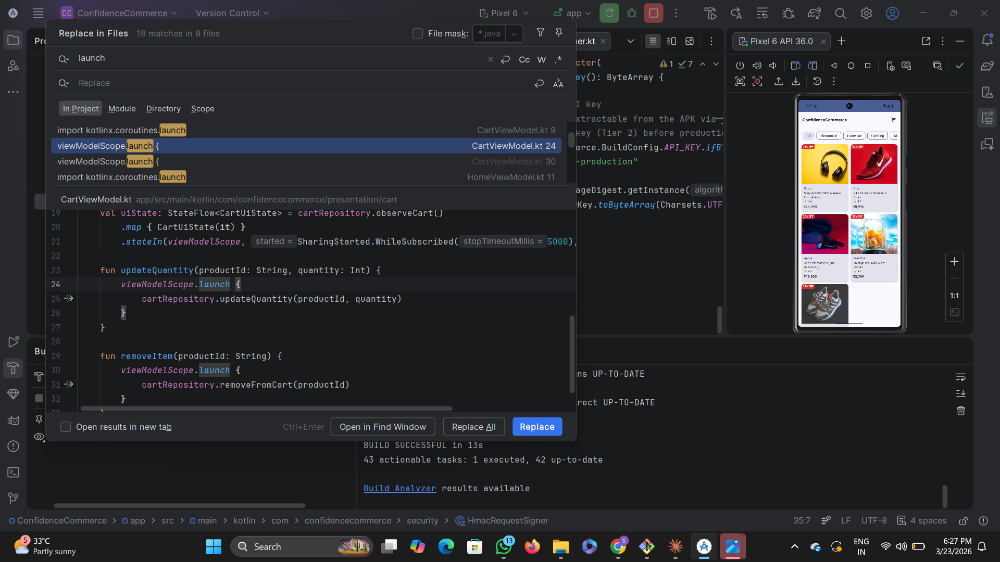
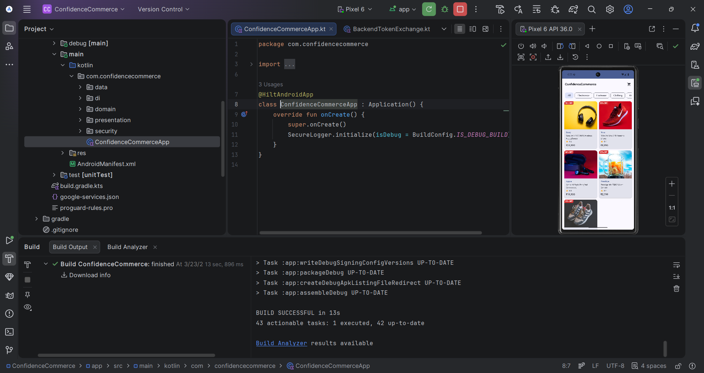
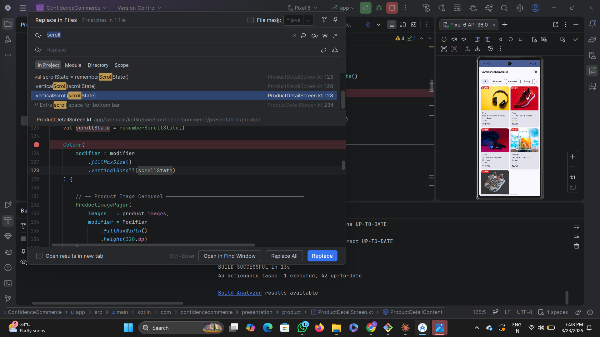

# 🛍️ E-Commerce Mobile App — Production-Oriented Android Architecture

A modern Android E-Commerce application engineered using **Kotlin + Jetpack Compose + MVVM + Clean Architecture**, designed to simulate real-world scalable product development.

This repository reflects practical engineering decisions around **state management, modular separation, failure handling, and maintainable UI architecture.**

---

## 🎯 Engineering Objective

The goal of this project is NOT just building screens.

It focuses on:

* Designing scalable architecture
* Handling unreliable network conditions
* Maintaining UI consistency
* Enabling future feature expansion
* Following professional Git workflows

---

## 🧠 Architectural Design

This project follows a layered Clean Architecture approach:

```
UI (Compose Screens)
   ↓
ViewModel (State + Business Coordination)
   ↓
UseCases (Domain Logic)
   ↓
Repository Abstraction
   ↓
Remote / Data Source
```

### Why this matters

* UI becomes replaceable
* Business logic becomes testable
* Data sources become swappable
* Feature modules can scale independently

---

## ⚙️ Core Technical Highlights

* Jetpack Compose Declarative UI
* Navigation Graph State Driven Flow
* Coroutine + Flow Reactive Streams
* Repository Pattern Abstraction
* Structured Error / Retry Strategy
* Loading State Synchronization
* ViewModel Lifecycle Awareness
* Feature-based package separation

---

## 📦 Feature Scope

* Authentication Flow Simulation
* Product Listing Experience
* Detail Screen Navigation
* Network Failure Recovery UI
* Progressive Loading Feedback

---

## 📁 Repository Structure Philosophy

The structure reflects **maintainability over speed.**

```
presentation/
domain/
data/
navigation/
utils/
```

This reduces coupling and improves onboarding speed for new engineers.

---

## 🚀 Running the Project

Clone → Open in Android Studio → Sync Gradle → Run.

---
## 📱 Application Screens

| 🚀 Launch | 🏠 Home |
|----------|--------|
|  |  |

| 🧩 Categories | 📜 Scroll Experience |
|--------------|---------------------|
|  |  |

## 🧩 Engineering Tradeoffs

| Decision           | Benefit               | Tradeoff           |
| ------------------ | --------------------- | ------------------ |
| Clean Architecture | Long term scalability | Initial complexity |
| Compose UI         | Faster UI iteration   | Learning curve     |
| Repository Layer   | Testing flexibility   | Boilerplate        |

---

## 📈 Future Engineering Roadmap

* Cart state persistence
* Payment flow orchestration
* Offline caching strategy
* Unit + Integration testing
* CI pipeline automation
* Modular feature delivery

---

## 👨‍💻 Developer Note

This project represents hands-on exploration of building **production-ready Android architecture rather than tutorial-driven implementation.**

---

⭐ If this repository demonstrates useful engineering patterns — consider starring it.
